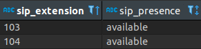

# PythonPresence  
> SIP Backend for BLF and WebPresence through PostgreSQL and JSON based SIP commands written in Python 2.7  

## Notes  
- The database helper class currently only supports PostgreSQL. This can be very easily changed to any flavor of SQL you like. 
- A SIP message is sent out to a COMMAND extension, this is to notify everybody that the database was updated.
You need to write something in your SIP client to parse these JSON requests and act on them accordingly. Otherwise, you can turn this off easily
in the config. 
- The app is written in Python 2.7 because of compatibility reasons with SIPSIMPLE, the SIP stack library used in this application.  
- You need to add an account with SIPSIMPLE in your favorite terminal emulator before you can run the app.
  > sip-settings -a add user@domain password  

## Dependencies   
To start, add the signing key and repo for SIPSIMPLE that corresponds with your OS here: 

  > https://docs-new.sipthor.net/w/debian_package_repositories/  
  
Afterwards, run these commands in your favorite terminal emulator to install the dependencies.
The package manageres apt and pip are required. 

> sudo apt install python-dev 

> pip install configparser    

> pip install psycopg2    

> sudo apt-get install sipclients  

> sudo apt install python-sipsimple  

These dependencies are for python dev tools, config files, postgres support, SIP configuration and SIP stack support respectively.
